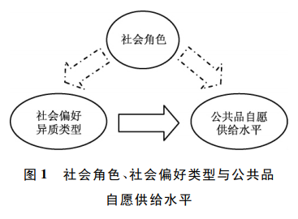
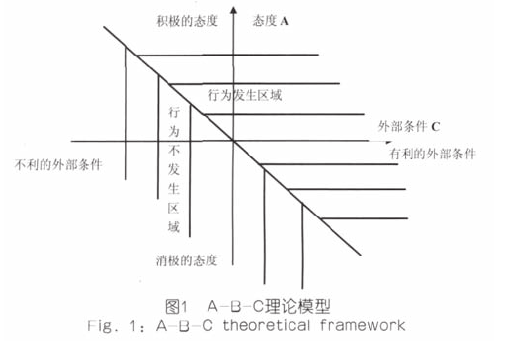

# 不知道该取个啥标题
禀赋
效应来源于卖方把商品作为已有财产来对待, 是不打
算 “失去”的, 但在多次交易的商人手里则完全不同,
这给政策实施以新的启示, 即倘若污染权的分配由独
立的职业拍卖方拍卖, 交易会容易实现。当然在市场
机制不是很健全的我国, 职业拍卖更为重要, 它可以
避免不必要的租金损失。\par
行为人衡量收益和成本的贴现率在
不同的时间是不一致的 (Laibson, 2003)。 行为人对那
些在较近的未来有得益的项目有较大的折算率, 而对
那些比较远的得益有较小的折算率, 或者说行为人是
有即时冲动的 (Laibson, 2003)。\par
现状偏好理论” (Kahneman, 1991)是指行为人
更偏向于维持现状而不是改变。在环境经济学中, 它
体现为即使在市场上有一个很有效的技术, 污染者也
倾向于维持现状, 因为高昂的成本会使行为人夸大这
种损失, 这就导致一种次优的结局。

\section[一篇硕士论文（新疆大学）]{关于环境的行为经济学分析——杨干生}
\subsection{关于环境的行为经济学分析}
\subsubsection{经济主体追求环境福利最大化时的有限理性}
#### 参照效应
#### 敏感度降低效应（diminishing sensitivity）
#### 不愿失去效应

\subsection{在经济主体不是追求福利最大化时的行为分析}
\subsubsection{追求公平及遭受不公平时进行报复}
\subsubsection{意识形态的经济意义}
**意识形态的4个假说** \\
> H1：意识形态对特定人群中各围观经济主体目标函数的影响
> H2：对特定人群中各经济利益主题预期效用函数的影响
> H3：意识形态与经济决策主题之间的互动
> H4：环保主义意识形态
  > 共同信仰
  

# 大学生环保行为的经济学实验研究

## 摘要 
运用实验经济学研究方法，基于博弈视角，不仅设计了不同奖惩机制，且
考虑到社会规制和声誉因素的影响，设计了关于高校宿舍垃圾分类行为的经济学实验。最后结合传统调查问卷形
式，探讨个体特征与决策行为的联系。实验方法获得的数据真实可靠，对于高校或政府等公共部门制定环境监管
政策具有重要意义。

## 引言
## 文献综述
国内外大量研究
表明，奖惩措施是影响个体捐献的有效举措之一。实施
\textcolor{red}{奖惩措施}有效地减少了公共物品捐献中的搭便车现象，
提高了捐献水平，维持群体内的合作\par

关于公共物品捐献中搭便车者的行为动机，国内
外学者从生物学、经济学、社会学和心理学等不同学科
视角展开研究。从个体特征的角度出发 ：Chaudhuri & 
Sbai[
11]
使用随机匹配的方式进行重复实验，研究发现在
信任水平上不同性别并没有强烈差异，但与男性相比女性互惠水平更低 ；周业安等[
12]发现，不同性别的个
体表现出有差异的社会偏好，并影响公共物品的自愿供
给水平 ；Sutter 等[
13]以儿童和青少年为研究对象设计激
励实验，发现性格暴躁的儿童和青少年更容易用钱购买
烟酒，储蓄倾向相对较低。从社会偏好的角度出发 ：刘
文忻等发现，个人社会偏好异质性对实验中的合作行为
有显著影响，而影响公共物品提供的主要外在因素是信
息交流和私人收益率 ；Carlsson 等[
14]研究了在修建桥梁
事件中，社会因素对个体捐款行为意愿的影响，结果表
明社会偏好信息的公开对捐款行为具有促进作用，例如，
如果个体捐款为零，平均捐款额会降低 20%。从社会声
誉因素的角度出发 ：Markowitz & Shariff[
15]发现社会的
交互行为，包括自豪感、羞耻感等，可能会促进个体的
环保行为 ；Ashraf 等[
16]研究了在公共组织中非物质奖
励如何影响个体工作行为 ；Kosfeld & Neckermann[
17]，
Bradler 等[
18]在公司里进行了田野实验，分析了非物质
奖励（即积极的社会认知与社会声誉）如何影响员工的工
作情况 ；Bénabou & Tirole[
19]研究发现很多人为了提高
自己的形象和声誉愿意采取有利于社会的行为，通过自
己的行为希望自身得到社会的认可。 \par

在研究高校宿舍垃圾分类行为中，很多学者也从不
同的角度进行了多方面的研究。从高校垃圾分类现状的
角度出发 ：梁爽等[
20]通过问卷调查、访谈等方式，调
查研究了长株潭各高校的垃圾分类现状，并在此基础上
提出了加大宣传教育，增加资金投入，细化分类标识，
鼓励环保类社团参与等垃圾分类回收的改进方法 ；王丹
青等[
21]以烟台大学为例，采用问卷调查、实地调研的
方法，对高校生活垃圾源头分类行为进行调查分析，结
果表明，生活垃圾源头分类在高校虽已被普遍认可但在
实际分类中存在“知与行不合一”的现象。从高校学生垃
圾分类意识的角度出发 ：李雪芹[
4]采用问卷调查法，对
江西省几所高校学生垃圾分类回收参与意识进行调查，
结果显示，目前大学生垃圾分类回收意识欠缺，对垃圾
分类回收的知识知之甚少，对垃圾分类回收责任主体认
识错位，未养成垃圾分类回收的习惯 ；尹洁林等[
22]学
者以大学生群体为研究对象，讨论大学生电子垃圾回收
行为意向的影响因素以及各种增加电子垃圾回收行为做
法有效性的偏好 ；陈绍军和李如春[
23]采用二元 logistic
回归模型，对影响城市居民垃圾分类意愿和行为的因素及其差异进行了实证分析，并进一步探讨垃圾分类的内
在机制。从高校垃圾分类管理模式的角度出发 ：张宏艳
和王卓然[
24]对高校学生生活垃圾资源化可行性进行了
分析，提出了简单可行的高校生活垃圾资源化管理模式；徐文立[
25]运用现代网络资源，建立垃圾换积分，积分
换实物的网络回收服务平台，实现垃圾与物品之间的有
效交换，使大学生真切感受到生活垃圾的价值，促进校
园文明健康和安全稳定。\par

\textcolor{red}{现有文献中获得数据的方法基本上都是问卷调查}
等传统形式。\textcolor{blue}{其缺陷}:

> 首先，数据结果普遍具有一次性的缺陷，而且变量难以控制 ；\newline
> 其次，通过问卷调查得到的数据，只能对测试人
员的行为进行静态分析，而人类的行为选择是动态变化
的[
26] \newline
> 最后，垃圾分类等资源环境问题是在受到人类各
种行为特征和行为选择的长期作用影响下形成的，一次
简单的问卷调查很难得到测试人员的真实行为信息。

## 实验设计机制与参数选择
使用的时z-tree

## 研究假设与实验设计
该实验设计了一个完全控制组和五个实验组：
1. 声誉控制组
2. 奖励实验组
3. 惩罚实验组
4. 奖励惩罚实验组
5. 社会规制实验组 \par
Ostrom[
28]，Rueden & Gurven
[29]
的研究表明有代价的惩罚对维持合作具有明显的作用，
人们宁愿付出代价惩罚搭便车。Gintis & Fehr[
30-31]比较
设置惩罚之前和之后的捐献，发现在设置惩罚之前，约
10 次后捐献降到一个较低的水平，并且上次比平均捐献
水平高的参与者，这次较少捐献。在设置惩罚之后，平
均捐献水平保持在个人拥有的一半货币（实验中使用的
捐赠代替物）以上，高捐献情境下，几乎没有人继续使
用惩罚。

## 实验结果与分析
## 个体特征与垃圾分类行为的联系
\footnote{文中，设置环境规制的时候，能够使垃圾分类率维持在规制水平左右，根据作者的结果来看，有一部分的参与者的垃圾分类率维持在一个较低的水平；然而，这是一个单次博弈，如果进行重复博弈，结果是否会有不同}

\section[城市居民生活垃圾分类机制研究]{医院与行为的背离：城市居民生活垃圾分类机制研究}
## 摘要
城市居民垃圾分类意愿和行为存在
较大的差异，愿意参与垃圾分类的比例( 82． 5% ) 明显高于实际参与垃圾分类行为的比例( 13% ) ，较高的分类意愿并不必然会产生较
高的分类行为; 其次，影响垃圾分类意愿和行为的因素有差别，垃圾分类行为的实现取决于情境因素/便利性、认知和态度，垃圾分类
意愿则主要受认知和态度、个体特征、推动措施的影响: 第三，垃圾分类意愿和行为影响因素的重要程度有差别，垃圾分类行为受情境
因素/便利性影响较大，垃圾分类意愿受个体特征等主观因素影响较大，认知和态度对分类意愿和行为都具有重要影响; 垃圾分类试
点的成效对分类行为影响更大，分类意愿影响不显著。 \par

从 2011 年中国
城市生活垃圾清运和处理情况来看，约 78% 的城市生活
垃圾无害化处理采用垃圾填埋的方式，20% 采用垃圾焚烧
的方式，两者之和所占比例高达 98% 左右，这表明城市生
活垃圾基本上采用的是填埋和焚烧两种方式。\newline

> \textcolor{red}{坏处} \newline

1. 增加了城市生态环境污染防治
的压力，给城市公共财政预算分配和城市环境管理带来了
巨大的挑战
2. 加剧了城镇化过程中尖锐的人地矛盾，填埋场生活垃圾厌氧
降解产生的大量 CH4和 N
2
O 成为主要温室气体的重大释
放源［
2］
，直接造成促进全球气候变暖的社会事实; 

## 文献回顾
### 个体的内在过程因素与生活垃圾分类回收
1. 垃圾分类知识与非类型为相关  
2. 垃圾分类回收的态度直接影响相关行为\par
Howenstine 对芝加哥地区部分家庭不进行分类回收的 12
个原因进行归类，其中对垃圾分类回收持有麻烦感、位置
不满意和冷漠态度这三个因素的解释占了 54%［
12］
，这表
明对垃圾分类回收的特定态度影响了居民的分类行为，同
样的结论也出现在其他相关研究中［
5 －6］\par
3. 少量研究关注了个性与垃圾分类回收之间的关系。\par
Simmon 等研究发现支持
垃圾分类回收的人更可能把分类回收当成一种负责任的
行动，前提是行为者具有一定的分类回收知识［
13］\par
4. 关于分类回收行为的研究中，
最常见的人口统计变量分别是年龄、性别、教育和收入。\par
龄与分类回收行为之间的关系是模糊的，包括是否存在
相关关系以及影响方向。Vining 等和 Lansana 的研究都表
明年龄越大越可能参加分类回收［
6，15］
，Gamba 等的研究则
得出微弱负相关的结果，Oskamp 等发现没有关系［
16］
，
Domina 等将这种矛盾归因于代际效应［
17］
。受教育程度通
常会被认为是分类回收行为的一种可能预测因子，但两者
之间 的 关 系 并 不 明 确［
8］
。如 Gamba 等、Oskamp 等 和
Hopper 等的研究 结 果 表明 两 者 之 间 没 有 关系［
5，16，18］
，而
Vining 等和 Lansana 则发现存在正相关［
6，15］
，Schultz 等把
这种差异归结于受教育水平变量设定和样本量大小不
同［
14］
。在性别方面，分别对广东和香港的垃圾分类回收
行为研究中发现女性参与的热情低于男性［
19 －20］
，相反的
观点同样存在［
14，21］
; 但更多的学者的研究表明性别与垃圾
回收之间没有必然关系［
5，8，16 －17］
。与性别关系不同，收入
和分类 回 收 之 间 存 在 正 相 关。Gamba 等、Vining 等 和
Oskmap 等的研究中得出赚钱越多的人比赚钱越少的人更
可能参与垃圾分类回收［
5，6，16］
。

### 外在的情境因素与生活垃圾分类回收
1. 分类服务和设施主要包括回
收投放地点、设施设备、收集方式和频率等。  

2. 社会规范变量强调社会影响对分类的作
用，如内在的家庭成员，外在的朋友、邻居、同事等。  

3. 适当的推动措施如信息公开、发放宣传册、教育宣传、示范
等促进分类回收［
14］  

## 研究方法、数据来源与变量选择
### 研究方法
### 数据来源
### 变量选择

## 模型估计结果与分析
### 情境因素对垃圾分类的影响
### 人口社会统计特征对垃圾分类的影响
### 认知和态度对来及分类的影响
### 推动措施对垃圾分类的影响

## 结论与建议

# 社会角色、个体异质性和公共品自愿供给
## 摘要
个体社会偏好存在异质性; 搭便车行为和条件性合作者的自我服务偏向是公共
品自愿供给的两大特征事实， 两者对于公共品自愿供给水平有着至关重要的决定性作用。
分析结果表明个体社会偏好的异质类型会显著影响公共品自愿供给水平， 而性别和学生
干部等社会角色存在显著差异的个体异质类型分布， 由此间接地影响公共品自愿供给水
平。与此同时， 不同的社会角色也会直接影响公共品自愿供给水平。实验分析结果证实
并且揭示社会角色影响公共品自愿供给水平的直接影响效应和间接渠道效应。

## 导言
传统经济学关于免费搭便车者导致公共品自愿供给不足的说法有一个隐含的假定， 即参与人
具有同质化的自利偏好。新的实验研究已经发现， 现实中的参与人有大量\textcolor{blue}{亲社会合作行为}现象( 陈叶烽， 2010) ; ①同时， 大量
国外公共品实验证据已经揭示， \textcolor{blue}{非零值自愿供给现象}是显著且稳健的( Ledyard， 1995) ， 近年来国内
逐步开展起来的公共品实验研究也同样发现了这个现象\textcolor{red}{( 周业安、宋紫峰， 2008; 宋紫峰等， 2011; 宋
紫峰、周业安， 2011) 。}并且这些实验证据表明， 非零值自愿供给现象可以通过参与人所具有的\textcolor{red}{社
会偏好}来解释( 陈叶烽， 2010) 。 \par

现有的研究仍然存在两个关键的难题。\newline
第一， 社会偏好理论
只不过证伪了传统经济学的理性自利假定， 但并不能证伪同质性假定。所幸一些实验
经济学证据已经表明， 参与人 的 社 会 偏 好 具 有 异 质 性 ( Fischbacher et al． ， 2001; Fischbacher and
Gchter， 2006; Burlando and Guala， 2005) ， 周业安等( 2012) 基于中国的实验进行相关的研究同样发现社会偏好异质性的证据。\par

引入异质性社会偏好带来两方面的困扰：\newline
1. 个人社会特征可能通过作用于社会偏好来影响公共品供给， 也可
能直接作用于公共品供给， 这就使得我们需要谨慎处理社会偏好与公共品自愿供给水平之间的关
系;\newline
2. 异质性的程度难以把握，Kirman(1992)\par

[//]: # 下面的图片是从该论文中截取出来的

## 文献综述
### 有关异质社会偏好的研究
Fischbacher et al． ( 2001) 首先利用策略性方法在实验室中设计出
一个两阶段公共品博弈， 并在此基础上发现了被试异质社会偏好。\par

 Burlando ＆ Guala( 2005) 在 Fischbacher et al． ( 2001) 的基础上，
进一步引入博弈分解技术( Decomposed Game Technique) 、重复线性公共品博弈以及问卷调查方法\par

另有一些研究关注文化差异的影响， 如 Kocher et al． ( 2008) 采用 Fischbacher et al． ( 2001) 的方
法， 但选择美国的卡罗莱纳州、奥地利的因斯布鲁克市和日本东京这三个不同地方的被试进行比较
研究。\par

周业安等( 2012) 同样
基于 Fischbacher et al． ( 2001) 的方法， 对中国被试的异质社会偏好进行实验研究，\par

Hermann ＆ Thoni
( 2008) 则比较研究俄罗斯的农村和城市被试， 虽然发现社会偏好类型分布的差异性， 但并不显著，
说明同一文化下不同区域社会偏好并未表现实质差异， 间接论证文化可能产生的影响。

### 社会角色、异质社会偏好对公共品供给的影响

已有研究认 为个 体的 社 会 角 色 在 一 定 的 条 件 下 可 以 区 分 个 体 所 归 属 的 类 型。① Akerlof ＆
Kranton( 2000) 指出， 社会角色是个体与某一类别当中的个体相类似， 又与其他类别中的个体有所
差异的一个集合。Sen( 2005) 则表明个体能否获取其在社会群体当中的身份， 关键在于他们能否
为自己的社会角色归属找到依据， 并且决定是否以及在多大程度上将依据这些群体所运行的规则
行动。Horst et al． ( 2005) 所进行的个体和社会角色的分析则认为， 个体通过与社会群体其他成员
之间的互动形成自我印象。个体通过与社会的互动， 通过不断地匹配与他们认为的群体应该表现
出的社会特征而实现一个自我印象的群体归属过程。 \par

现有的理论研究发现， 个体社会角色会影响异质社会偏好， 进而会影响个体公共品
供给行为。迄今大部分实验研究结果也支持这一结论， 即个体的不同社会角色的强化或者突显会
明显影响个体差异的行为模式( Tajfel and Turner， 1986; Chen and Li， 2009; Buchan et al． ， 2011) 。不
过， 也有少数研究并不支持这一点， 比如 Hermann ＆ Thoni ( 2008) \par

综合现有研究成果发现， 异 质 社 会 偏 好 类 型 个 体 会 表 现 出 差 异 性 的 公 共 品 自 愿 供 给 水 平
( Fischbacher and Gchter， 2006， 2010) 。\newline
这些研究成果并没有具体考虑个体的社会角色对于\textcolor{red}{公共品自愿供给水平的直接和间接
效应。}\newline

## 实验设计

## 实验结果分析
### 个体社会偏好的异质性类型与公共品供给水平关系

# 大学生电子垃圾回收行为意向的影响因素研究
## 摘要
实证研究结果表明: 大学生的电子垃圾回收行为意向与他们所拥有的电子垃圾相
关知识、对于电子垃圾回收的特定态度、参与回收的个体规范、内控性特质、参与回收的社会规范显著正相关，而
与一般环境态度、回收的便利性无关; 在各种增加电子垃圾回收行为的做法中，有效性排在第一、二位的分别是
加大电子垃圾回收的基础设施建设和增加参与回收的经济报酬。

## 文献回顾与研究假设
Mannetti，Pierro，＆ Livi 认为，主要有两个与个体
动机相关的理论框架可用来解释人们参与回收的
行为。  

1. 由于个体都是追求其效
用最大化的，所以他们会根据物质刺激的大小来不
断调整自己的行为。

2. 个
体的内在价值观、信仰和态度等是其行为的主要激
励因素。\newline

现在，越来越多的研究将以上两
个框架结合起来，从更加全面的角度研究人们从事
回收行为的影响因素，比如 Valle 等人的研究［16
］
、
Michiyo 的研究［17
］
、Saphores 等人的研究［1
］等等。\par

一般环境态度是研究最多的消费者回收
行为的预测变量。但是，现有文献对于两者之间的关系并没有给出一致的研究结果［18 ～ 22
］
。有一部分
学者研究了特定的环境态度对于居民回收行为和
回收意向的影响。Tonglet 及其合作者在研究中发
现，亲回收态度是回收行为的一个主要预测变
量［23
］
。Corral-Verdugo［24
］
，Werner ＆ Makela［25
］
，
McCarty ＆ Shrum［26
］等分别在各自的研究中证实了
特定环境态度对于回收行为的影响。还有少部分
研究探索了过去的回收行为经验和回收行为两者
之间的关系。Michiyo 的研究发现，消费者过去的
回收经验对于回收行为的预测比态度变量对于回
收行为的预测更加有效［17
］
。Tonglet 等人也发现，
过去的回收经验是回收行为的一个重要预测变
量［23
］
。而另外一些学者从经济性角度考虑，认为回
收的便利性会对回收行为产生重大影响［27
］
。所研
究的相关变量包括回收箱的距离［28
］
、路边回收设施
的提供［8
］
、储存空间的大小［16
］等。同时，许多研究
调查了人口统计学变量、社会经济学变量与回收行
为之间的关系。调查最多的人口统计学和社会经济
学变量包括年龄、受教育程度、性别、收入、居住类
型、种族、家庭大小、政治联系等［29 ～ 31
，8，1］
。此外，现
有文献中所研究的回收行为的影响因素还有环境知
识［1
］
、社会规范［17
］
、个体规范［14
］
、控制点［32
］等变量。在对关于消费者回收行为影响因素的相关文
献进行回顾之后，我们不难发现，这些文献研究的
核心内容都可以整合到 Hwang，Kim ＆ Jeng 所提
出的“关于环境行为的理论框架”模型中。在该模
型中，Hwang，Kim ＆ Jeng 将影响环境行为的因素
分为三类: 认知因素、情感因素和情境因素［32
］
。

## 研究方法
### 调查问卷的设计
### 研究被试
### 变量的测量
### 统计分析方法

## 研究结果
### 各量表信度的检验
### 描述性统计

# 城市居民生活垃圾源头分类行为的理论模型构建研究

以社会心理学中的计划行为理论为基础，
结合A-B-C理论中外部因素对行为的影响作用，同时考虑不同年龄、性别、受教育水平和收入的群体在生活垃圾源头分类
行为意向和行为上是否存在差异，构建了我国城市居民生活垃圾源头分类行为理论模型。

## 生活垃圾源头分类行为的概念及其发展

本研究在借鉴Geller的观点的
基础上，将生活垃圾源头分类行为定义为：城市居民将产
生的生活垃圾按规定的类别分类收集，并将这些分类收集的垃圾投放到指定地点或卖掉的行为。

早在20世纪60年代，美国为了解决不断增长的
垃圾数量与逐渐紧缺的垃圾填埋场地之间的矛盾问题，开
始着手研究垃圾的循环利用，并于1970年成立了国家资
源循环利用中心，主要进行废物循环利用方面的开发研究
和实践。  

兰已通过立法，要求从1994年开始，所有
居民要实施生活垃圾中有机物与其他垃圾的源头分类。法
国从2004年起就已全部实施垃圾分类收集。美国目前最
流行的垃圾分类方式是在居民小区内进行垃圾分类以及设
立可循环物质回收网点，如在停车场设立具有醒目标志的
可回收物质的垃圾箱。

## 生活垃圾源头分类行为研究相关理论

### 计划行为理论
该理论是Ajzen提出的态度—行为关系
理论。该理论认为，影响现实行为的主要决定因素是行为
的意向，行为的态度（即个人对这一行为是否有助于达到
有价值的结果的态度）、主观规范（subjective  norm，即
感受到的社会压力的影响）以及感觉到的行为控制（包括
两个成分：一是个体对自身完成相应行为的自我效能感，二是个体对行为实施与否的控制能力）会通过行为意向影
响现实行为。

### A-B-C理论
Guagnano等提出的
A-B-C理论认为，生活垃圾循环利用行为（behavior，B）是个体对循环利用所持有的态度变量（attitude，A）
和外部条件（condition，C）共同作用的结果
[10]。

## 源头分类行为理论模型构建研究
### 理论基础

### 理论模型的构建
#### 居民生活垃圾源头分类行为（BSS）
#### 行为意向（BI）
#### 环境价值观（EV）
#### 环境态度（EA）
#### 心理变量

# REFERENCE
\noindent
[1] 基于行为经济学的环境政策有效性分析，刘金平 孔元
