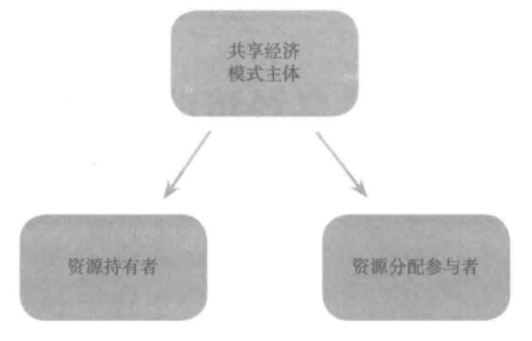
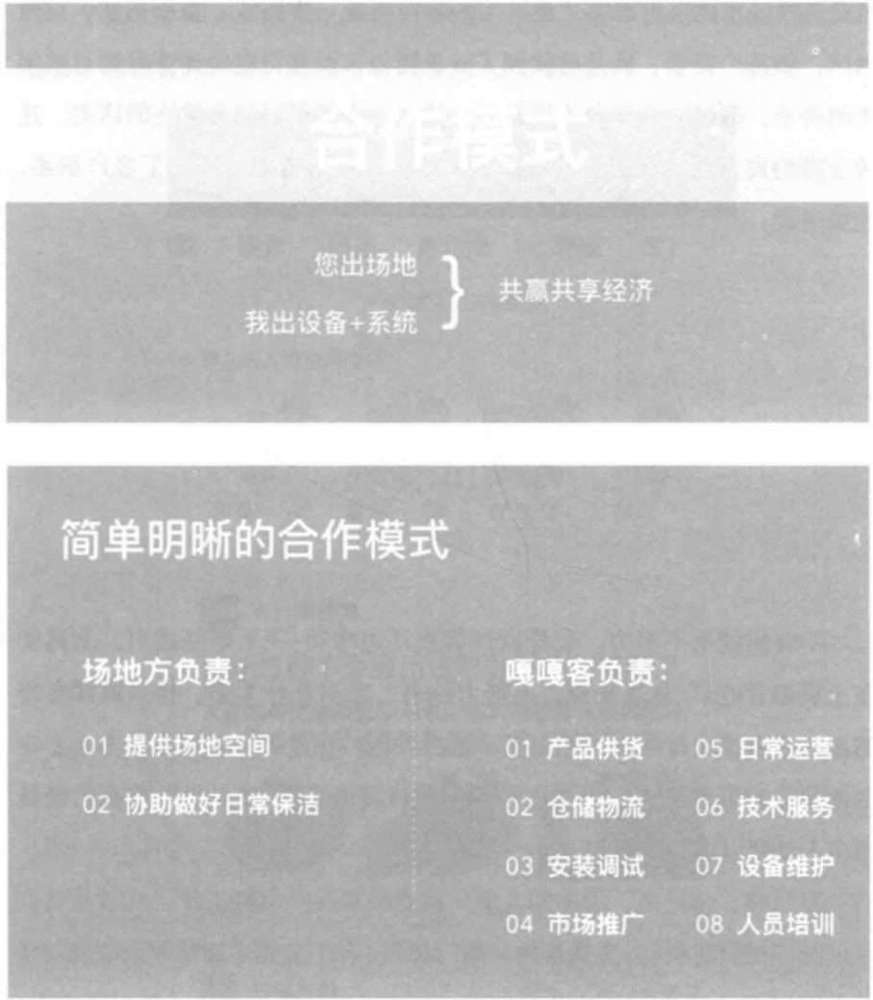
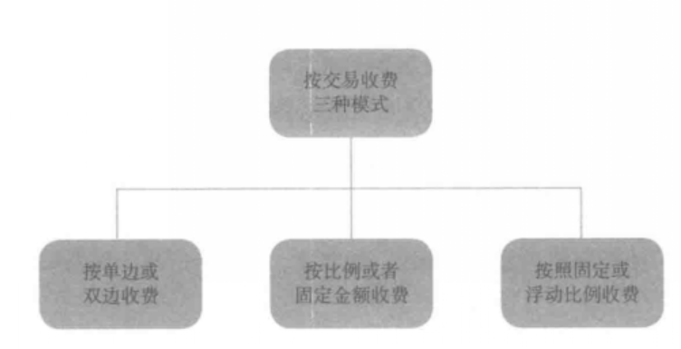
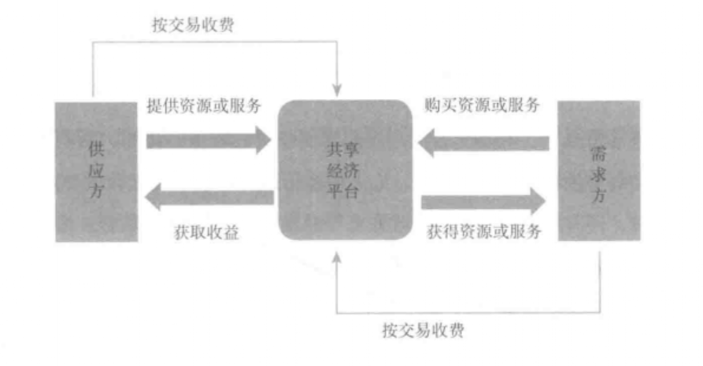
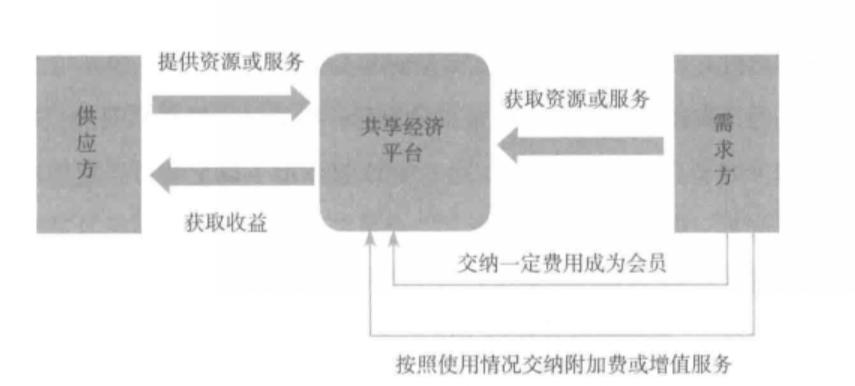
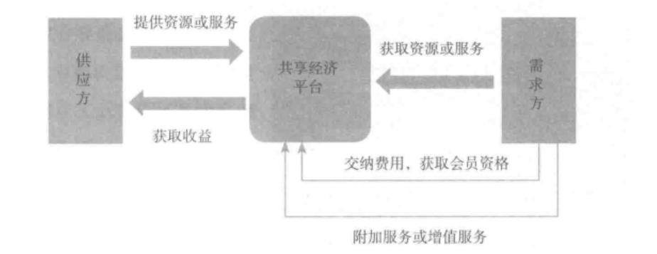
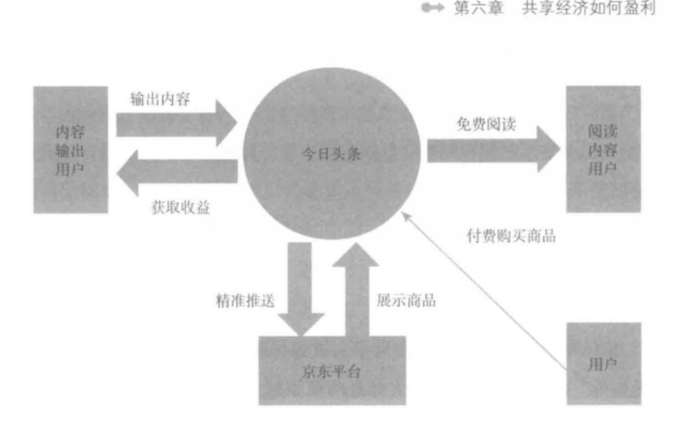
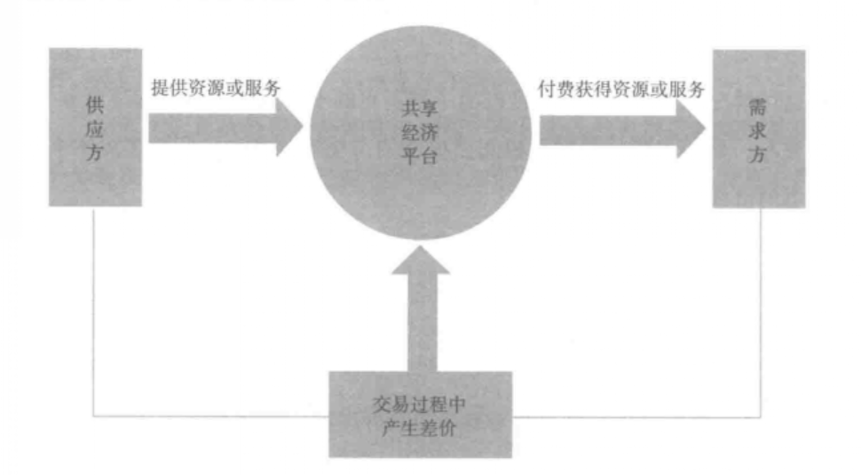

background-image: url(caida1.png)
background-repeat: no-repeat
background-position: center
background-size: contain

# 引言
“共享经济”一词,虽然在20世纪70年代才被正式提出,但是“共享”模式自古有之。早在原始社会人类就已经发现了共享的重要性,那时人类个体力量是非常薄弱的,无法抵御自然灾害、野兽侵袭,于是就出现了人类族群,大家聚在一起生活,逐步产生了分工,女人负责照看孩子、做饭,男人则外出捕猎、保护族群的安全,而在族群里食物是共享的，领地也是共享的。  

- **空间限制**  
- **信任关系**

---
background-image: url(caida1.png)
background-repeat: no-repeat
background-position: center
background-size: contain
# 一、共享经济的概念
- **共享经济是指拥有闲置资源的机构或个人有偿让渡资源使用权给他人,让渡者获取回报,分享者利用分享自己的闲置资源创造价值。**  
- **其实,共享经济的本质就是整合线下的闲散物品、教育医疗资源、劳动力;也有人说共享经济是人们公平享有社会资源,各自以不同的方式付出收益共享经济红利。** 

共享经济的鼻祖罗宾•蔡斯认为,要了解什么是共享经济,首先要看懂三个金句：
- “共享经济”金句NO1:没有一个房间也可以开酒店,没有一辆车也可以开租车公司,没有一件商品也可以开商场。 
  - 共享经济的精髓在于使用和享用,而不是拥有。 
- “共享经济”金句NO2:你的就是我的,我的也是你的。 
- “共享经济”金句NO3:每个人都知道你是一条狗,但却没人在意。 
  - 这句话的意思是说,在共享经济中,没有人会在意你是谁,你长得怎么样,你有怎样的性格,他们只在意你的产品和信誉。

---
background-image: url(caida1.png)
background-repeat: no-repeat
background-position: center
background-size: contain
# 一、共享经济的概念
2015年中国共享经济市场规模约为**19560亿元**,主要集中在金融、生活服务、交通出行、知识技能、房屋短租、生产能力等六大领域;共享经济领域参与提供服务者约为**5000万**人,参与共享经济活动的总人数保守估计也有超过**5亿**人;预计未来五年共亨经济年均增长速度在**40%**左右,到2020年市场规模占GDP比重将达到**10%**以上,未来十年中国共享经济领域有望出现**5~10**家巨无霸平台型企业。  
<h4 style="color:Crimson">我国发展比较好的共享经济企业：</h4>
- 滴滴快车 
- 猪八戒网 
- 木鸟短租 
- 瓜子网 
- 阿姨帮 
- 疯狂老师 
- 河狸家 

---
background-image: url(caida1.png)
background-repeat: no-repeat
background-position: center
background-size: contain
# 一、共享经济的概念
<h4 style="color:Crimson">租赁跟共享经济的区别:</h4>
1. 租赁会让出租者失去对所出租物品的控制权
2. 租赁获得的回报更稳定
3. 共享的前提是“闲置”
4. 共享经济与租赁经济的核心不同 

<h4 style="color:Crimson">共享经济的构成要素：</h4>
1. **主体要素**

---
background-image: url(caida1.png)
background-repeat: no-repeat
background-position: center
background-size: contain
# 一、共享经济的概念
<h4 style="color:Crimson">共享经济的构成要素：</h4>
2. **交易对象：**
  - 实物
  - 非实物等等

3. **核心要素：共享平台**
  在共享经济模式中,共享平台起着桥梁的作用,连接着供给方和需求方
  
4. **其他参与方**
  - 第三方支付
  - 监管机构
  - 评估机构
  - 征信机构

---
background-image: url(caida1.png)
background-repeat: no-repeat
background-position: center
background-size: contain
# 二、共享经济的特征
## 1.基于互联网平台
1. **扩大共享范围**
  有了互联网之后,人们租借物品的范围就可以扩大了,一来有了共享平台,我们可以获得更多的相关信息,二来我们可以超出自己所熟知的人群范围,向陌生的人租借物品。  
2. **获得对称信息**
  人们获得信息更加便捷,更加全面,需求方只需将信息发到共享平台网站,就可以在几分钟甚至几秒钟找到所需的物品,同样,供给方也能迅速知道谁需要自己手中闲置的物品,从而快速地完成交易。  
3. **节省时间**

---
background-image: url(caida1.png)
background-repeat: no-repeat
background-position: center
background-size: contain
# 二、共享经济的特征
## 2.大众参与
大众参与是指供需双方的无限性，也就是说，要把无限多的资源和无限多的需求整合到一个平台上，足够多的供给方和足够多的需求方共同参与是分享经济得以发展的**前提条件**。  
**大众参与的两个效应**：
- 一是让有效的资源找到最合适的用户，不管什么样的资源，只要放到共享平台，让更多人看见，总会有人需要  
- 二是多样化的需求找到最合适的提供者，需求方的人数众多，所需的资源也是多种多样的，但是只要有足够多的供给者，需求方的需求总能得到满足。

---
background-image: url(caida1.png)
background-repeat: no-repeat
background-position: center
background-size: contain
# 二、共享经济的特征
## 3.资源要素的快速流动和高效配置
**资源是有限的，但是闲置资源浪费也普遍存在。**共享经济就是将这些大量、分散的资源通过互联网整合起来，让其发挥最大的功效，以满足人们的需求。
<h4 style="color:Crimson">Example:</h4>
**嘎嘎客共享按摩椅**:
  共享按摩椅这个项目就解决了资源浪费的问题,提高了资源的利用率,可以让有需要的人共同来使用,实现了资源的高效配置。在未来会有很多类似按摩椅这样家庭使用效率不高,又需要使用的产品会共享出来,这是一种趋势,但充电宝、雨伞这样的物品,产品价格较低,一般家庭都会购买,普及率非常高,那么,共享就没有意义了。
  
---
background-image: url(caida1.png)
background-repeat: no-repeat
background-position: center
background-size: contain
# 二、共享经济的特征
## 4.权属关系新变化
**共享经济模式会使权属关系发生新的变化,一般来说,它通过所有权与使用权的分离,采用以租代买、以租代售等方式让渡产品或服务的部分使用权,提高资源的利用率。**  
<h4 style="color:Crimson">Example:</h4>
**滴滴出行最初做的并不是共享经济,而是出租车的信息化.**滴滴最早的想法就是用互联网连接所有路上的交通工具,把用户的需求从线下打车移到互联网上,从而将打车这一线下行为转变到线上来,提高用户的体验。  
后来,滴滴又推出了**滴滴专车和滴滴快车**,试图用此来缓解高峰期打不到车的情况,但并没有好的效果,而且这种办法是行不通的,因为如果在高峰期人人都能打到车,就意味着在**低谷期**,很多车都要闲置起来。  
**再后来,滴滴改变了策略,它的平台吸纳了很多非职业的司机**

---
background-image: url(caida1.png)
background-repeat: no-repeat
background-position: center
background-size: contain
# 二、共享经济的特征
## 5.用户体验最佳
对用户来说,共享经济带来的最大实惠就是体验感大大提高了  
<h4 style="color:Crimson">共享经济的应用领域</h4>
- 共享出行
- 网约车
- 共享单车
- 共享汽车
- 共享空间。办公空间（写字楼）
- 公寓民宿

---
background-image: url(caida1.png)
background-repeat: no-repeat
background-position: center
background-size: contain
# 二、共享经济的特征
## 5.用户体验最佳
<h4 style="color:Crimson">共享经济的应用领域</h4>
- **共享金融**
  - **P2P网贷模式**
  P2P网贷也就是我们说的网络借贷,是指个体和个体之间通过互联网平台实现的直接借贷
  - **众筹模式**
  众筹模式,是指一种向群众募资,以支持发起的个人或组织的行为般通过网络上的平台连结起赞助者与提案者,通过众筹得来的资金被用来支持各种活动
- **共享美食：**美国的一家网上订餐平台Open table
- **共享医疗：**如Heal、 Pager、 Medicast等
- **共享公共资源：**
- **共享知识教育**：**知网**

---
background-image: url(caida1.png)
background-repeat: no-repeat
background-position: center
background-size: contain
# 三、共享经济的优势
<h3 style="color:Crimson">1.增加消费者剩余</h3>
共享经济倡导的是**“不求拥有,只求使用”**的价值理念,以租赁代替购买,从而大大地降低了**交易成本**,提高了**资源的利用率**。 
总之,共享经济带给消费者的是最大好处是**节省成本**,这种成本不仅是金钱上的,还包括时间与精力,它能实现供需双方迅速高效地匹配,由于在一定程度上**制约了垄断**,使得商家不得不降低销售价格,那么,消费者就可以用更少的钱买到满意的产品,从而提高了消费者剩余。

<h3 style="color:Crimson">2.提高资源利用率，让过剩产能创造价值</h3>
共享经济这一概念,是由 **Zipcar创始人蔡斯**提出的一种新的商业模式即利用过剩产能,搭建一个共享平台,每个人都可以参与其中,将个人拥有的过剩资源分享给其他人使用,并获得一定的收益,过剩产能、共享平台与人人参与的完美集合,就是共享经济。

<h3 style="color:Crimson">3.实现大众创业目标</h3>
共享经济需要人人参与,人人也都可以参与

<h3 style="color:Crimson">4.创建新的营销模式，创造新的商业价值</h3>
如嘎嘎客共享按摩椅
---
background-image: url(caida1.png)
background-repeat: no-repeat
background-position: center
background-size: contain
# 三、共享经济的优势

---
background-image: url(caida1.png)
background-repeat: no-repeat
background-position: center
background-size: contain
# 三、共享经济的优势
<h3 style="color:Crimson">5.让知识变现</h3>
<h3 style="color:Crimson">6.降低创业成本</h3>
**可以说,在共享经济出现之前,所有的创业都需要雄厚的资金做支持,没有雄厚的资金,创业根本无法成功。**2015年夏季达沃斯论坛上李克强总理提出“大众创业,万众创新”,就在共享经济的背景下提出的,共享经济可以降低创业成本,为人人创业提供了可能。

---
background-image: url(caida1.png)
background-repeat: no-repeat
background-position: center
background-size: contain
# 四、共享经济如何盈利
<h3 style="color:Crimson">1.需求真实存在,却远远没有被满足</h3>
大中城市每到上下班高峰期,打车的人特别多,但出租车的数量是有限的,根本无法满足人们的需求,造成了很多人都打不到车。
<h3 style="color:Crimson">2.通过共享可提高收益或使成本下降</h3>
<h3 style="color:Crimson">3.共享模式下,人人受益,受益者占大多数</h3>
<h3 style="color:Crimson">4.不存在漏洞</h3>

---
background-image: url(caida1.png)
background-repeat: no-repeat
background-position: center
background-size: contain
# 五、共享经济企业的盈利模式
## 1.按交易收费

---
background-image: url(caida1.png)
background-repeat: no-repeat
background-position: center
background-size: contain
# 五、共享经济企业的盈利模式
## 1.按交易收费
按交易收费，供应方与共享经济平台是如何获取收益的，需求方是如何付费的？如下图所示

---
background-image: url(caida1.png)
background-repeat: no-repeat
background-position: center
background-size: contain
# 五、共享经济企业的盈利模式
## 1.按交易收费
<h4>按单边或双边收费:</h4>
单边收费主要是向需求方或者供应方收取一定的费用
<h4>按比例或者固定金额收费:</h4>
<h4>按照浮动或者固定比例收费:</h4>

---
background-image: url(caida1.png)
background-repeat: no-repeat
background-position: center
background-size: contain
# 五、共享经济企业的盈利模式
## 2.挖掘客户资源价值
**在互联网时代,什么东西最贵?流量最贵,流量就是客户资源,拥有了客户就有了变现的可能**
## 3.收取使用费用
共享平台可以通过使用费用来获得收益,这也是共享平台经常使用的种盈利模式，比如淘宝
## 4.收取会员费
<h4>1.简单的会员制</h4>
简单的会员制是相对多级会员而言的,收费的模式也很简单,一次性支付使用费用,无需再支付其他费用,就可以获得所有商品或服务的使用权。

---
background-image: url(caida1.png)
background-repeat: no-repeat
background-position: center
background-size: contain
# 五、共享经济企业的盈利模式
## 4.收取会员费
<h4>2.会员制+按使用情况收费</h4>
这种盈利模式就是在会员制基础上提供额外收费的增值服务,按使用情况收费,如图所示: 

---
background-image: url(caida1.png)
background-repeat: no-repeat
background-position: center
background-size: contain
# 五、共享经济企业的盈利模式
## 4.收取会员费
<h4>3.多级会员制</h4>
目前,共享经济平台采用多级会员制的情况也比较多见,盈利模式如下图所示,不同等级的会员支付的费用不同,或者可以使用不同的资源或者服务

---
background-image: url(caida1.png)
background-repeat: no-repeat
background-position: center
background-size: contain
# 五、共享经济企业的盈利模式
## 5.广告费用模式
为了吸引用户关注今日头条,“百万英雄”,答对了12道题就可以瓜分数十万乃至数百万奖金
## 6.利用延伸服务、衍生产品盈利
**凭借着智能算法,今日头条快速抓取用户数据,精准分析用户需求高效把关内容质量、进而实现个性化推荐的特征,深得电商平台的青睐。**  
**如何才能影响消费者的购物决策呢?今日头条的大数据就能帮助京东平台解决这个问题,用智能推荐算法外加消费者画像数据,就能直击消费者的痛点—需求与爱好。**

---
background-image: url(caida1.png)
background-repeat: no-repeat
background-position: center
background-size: contain
# 五、共享经济企业的盈利模式
## 6.利用延伸服务、衍生产品盈利
下面我们用一个简单地图形来梳理一下用户、京东平台、今日头条的关系

---
background-image: url(caida1.png)
background-repeat: no-repeat
background-position: center
background-size: contain
# 五、共享经济企业的盈利模式
## 7.赚取差价

---
background-image: url(caida1.png)
background-repeat: no-repeat
background-position: center
background-size: contain
# 五、共享经济企业的盈利模式
## 8.竞价排名
竞价排名按照付费最高者排名靠前的原则,对购买了同一关键词的网站进行排名的一种方式,按照**点击**付费.推广信息会出现在搜索结果中通常位置都会靠前,如果没有被用户点击、则不需要收费。不过,竞价名的价格是非常高的,有些关键词在Goge上的价格达到20~30美元/点击一次。一赶集网为例，普通用户一天只能发布一条出租信息，很显然，在信息海量的网站中，这样一条信息很快就会被淹没，要想长时间出现，只能付费置顶。

---
background-image: url(caida1.png)
background-repeat: no-repeat
background-position: center
background-size: contain
# 六、共享经济面临的挑战
<h4 style="color:Crimson">1.共享经济与传统经济的碰撞</h4>
共享经济作为一种新兴的经济形态,在商业理念与社会中已经存在的行业模式肯定会有不兼容的地方,所以,共享经济自从诞生开始,就受到了来自外界各方的挑战。
<h4 style="color:Crimson">2.共享经济存在隐患</h4>
主要表现在以下方面： 
1.  信任关系的建立   
2.  自由带来的不确定因素增强   
3.  法律风险
<h4 style="color:Crimson">3.共享经济是否会带来垄断</h4>

---
background-image: url(caida1.png)
background-repeat: no-repeat
background-position: center
background-size: contain
# 七、对共享经济未来的思考
## 消费者变成消费商
消费者身份的转变给商家带去的改变是商家不能用传统的思维去思考问题，要学会用共享经济，互联网+、大数据、以及倍增学原理来思考问题。  
而消费者身份的转变导致自由职业者的数量将会增多。

## 共享经济时代下的零售业
案例：宜家 

**那么共享经济对零售业会带来怎样的影响呢？**
1. 经营理念的改变 
2. 客户角色的转变 
3. 跨界经营 

可以预判地是,将来零售业与其他行业界限会变得越来越模糊,这就需要企业调整组织架构、业务流程、盈利模式,来适应客户碎片化时间求和移动空间的需求。